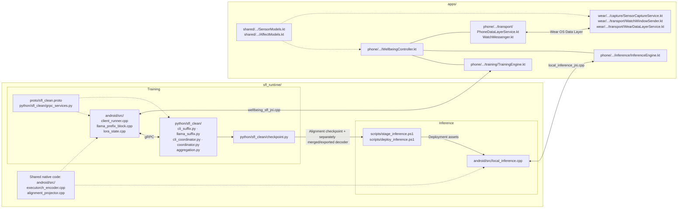

# Multimodal Stress Monitoring with Split Federated Fine-Tuning on Mobile Devices

We present an end-to-end mobile system for proactive stress monitoring from
wearable signals. The framework is supported by an extensible split federated
learning system that enables on-device LoRA fine-tuning of large language
models. By analyzing physiological data, the application distinguishes
emotional states, summarizes recent trends, and provides brief, actionable
suggestions.

## Repository overview

This repository provides the training, inference, and application code for the
system described in the paper:

- **Training:** Training uses a split federated learning (SFL) framework, with client-side code implemented in C++ and server-side code implemented in Python using PyTorch. Clients and servers communicate via gRPC.
- **Inference:** The C++ implementation connects the time-series encoder,
  modality-alignment layer, and LLM for on-device multimodal inference using
  ExecuTorch. Deployment scripts prepare the model assets for the phone.
- **Applications:** Android and Wear OS code handles sensor collection,
  watch-phone communication, and access to training and inference from the
  phone application.

The repository contains runtime code; the paper's visual UI is not included.
Model weights, datasets, exported models, checkpoints, SDK binaries, and APKs
are obtained or generated separately. External dependencies retain their own
licenses; see [THIRD_PARTY_NOTICES.md](THIRD_PARTY_NOTICES.md).

## Repository structure

The diagram groups the main source files by their role. Training and inference
share some native utilities, while the phone application accesses each through
a separate JNI interface.



The checkpoint arrow describes preparation for inference, not an automatic
conversion: the staging script requires a separately merged and exported LLM
decoder as well as the trained alignment checkpoint.

The directory layout also includes build configuration, tests, and supporting
documentation:

```text
.
├── apps/
│   ├── phone/                 # Android application runtime
│   ├── wear/                  # Wear OS sensing and communication
│   ├── shared/                # Shared data types, logic, and tests
│   ├── gradle/                # Gradle Wrapper
│   ├── build.gradle.kts
│   └── settings.gradle.kts
├── sfl_runtime/
│   ├── android/
│   │   ├── src/               # Training, inference, and JNI implementations
│   │   ├── include/sfl/       # C++ headers
│   │   ├── inference/         # Standalone inference build configuration
│   │   └── tests/             # Native tests
│   ├── python/sfl_clean/      # Servers, aggregation, and asset preparation
│   ├── proto/                 # Communication protocol
│   ├── configs/               # Training and inference configuration examples
│   ├── scripts/               # Build and deployment scripts
│   ├── tests/                 # Python tests
│   └── pyproject.toml         # Python package and dependencies
├── configs/                   # Configuration guidance
├── docs/                      # Reproducibility documentation
├── README.md
└── THIRD_PARTY_NOTICES.md
```

## Requirements

### Python services and tests

- Python 3.12-3.14
- PyTorch 2.13.0
- gRPC 1.83.0 and Protocol Buffers 7.35.1
- A CUDA-capable host for model training

The pinned Python dependencies are declared in
[`sfl_runtime/pyproject.toml`](sfl_runtime/pyproject.toml).

### Android and Wear OS applications

- Android Studio with Android SDK 37
- A JDK compatible with Android Gradle Plugin 9.2.0
- Android NDK r29 for the native SFL runtime
- An arm64 Android phone
- A Wear OS watch, or the included synthetic-watch build variant
- Samsung Health Sensor SDK 1.4.1 for physical Galaxy Watch8 sensing

Building the native SFL runtime additionally requires Visual Studio 2022 C++
Build Tools, gRPC v1.83.0 source, a compatible ExecuTorch checkout, and
MobileFineTuner at commit `b62d3b12a597e05489e6e8ef025527c613c94837`.

## Quick checks

These checks validate the public source without requiring model weights,
K-EmoCon data, or the Samsung SDK.

### Python tests

From the repository root:

```powershell
cd sfl_runtime
powershell -ExecutionPolicy Bypass -File scripts/build_host.ps1
```

The script creates `.venv`, installs the pinned package and development
dependencies, generates the Python protobuf bindings, and runs the test suite.

### Android and synthetic-watch builds

```powershell
cd apps
.\gradlew.bat :shared:test
.\gradlew.bat :phone:assembleDebug :wear:assembleDemoDebug
```

These commands validate the shared application logic and build the phone plus
synthetic-watch variants. The public app modules intentionally omit the paper's
visual UI and can be built without the native SFL libraries.

## Running the full system

Full SFL training requires separately obtained Llama 3.2 1B weights and
tokenizer, a compatible time-series encoder exported to ExecuTorch, labeled
sensor data such as K-EmoCon, the native Android toolchain, and reachable main
and federated servers. Physical Watch8 sensing additionally requires the
Samsung Health Sensor SDK.

Detailed preparation, build, staging, and execution commands are provided in:

- [SFL runtime documentation](sfl_runtime/README.md)
- [Native Android build and deployment](sfl_runtime/android/README.md)
- [Phone and Wear OS application modules](apps/README.md)
- [Reproducibility notes](docs/REPRODUCIBILITY.md)

## Current implementation status

- Python protocol, server, aggregation, and dataset utilities are implemented
  and covered by tests.
- Native Android SFL training has been exercised on physical phones with
  separately supplied runtime assets.
- Phone and synthetic-watch application builds have been verified.
- Physical Watch8 sensing requires the separately obtained Samsung SDK.
- Full local post-training inference requires a compatible embedding-input
  Llama decoder export and the matching trained alignment checkpoint.

## Paper

This repository accompanies the MobiHoc 2026 demo submission:

> **Demo: Multimodal Stress Monitoring with Split Federated Fine-Tuning on
> Mobile Devices**
> Qi Guo, Qiyue Xu, Jiaxiang Geng, Bing Luo, and Xianhao Chen

Citation information and the publication link will be added after publication.

## Disclaimer

This system is a research prototype. It is not a medical device or diagnostic
tool and has not been audited for production deployment.
