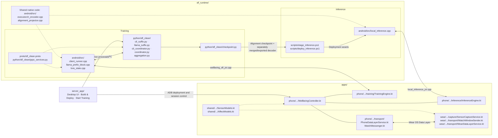

# Multimodal Stress Monitoring with Split Federated Fine-Tuning on Mobile Devices

We present an end-to-end mobile system for proactive stress monitoring from
wearable signals. The framework is supported by an extensible split federated
learning system that enables on-device LoRA fine-tuning of large language
models. By analyzing physiological data, the application distinguishes
emotional states, summarizes recent trends, and provides brief, actionable
suggestions.

## Repository overview

This repository provides the training, inference, and application code for the
system described in the paper:

- **Training:** Training uses a split federated learning (SFL) framework, with client-side code implemented in C++ and server-side code implemented in Python using PyTorch. Clients and servers communicate via gRPC.
- **Inference:** The C++ implementation connects the time-series encoder,
  modality-alignment layer, and LLM for on-device multimodal inference using
  ExecuTorch. Deployment scripts prepare the model assets for the phone.
- **Applications:** The desktop application manages Main Server and Federated Server,
  builds/deploys the phone runtime, and starts training. Android and Wear OS code handles sensor collection,
  watch-phone communication, and access to training and inference from the
  phone application.

The repository includes the phone UI: Vitals, Training, and Settings, connected
to the native training/inference runtime. HTML, CSS, scripts, and fonts are
bundled locally so the interface renders without a CDN connection.
Model weights, datasets, exported models, checkpoints, SDK binaries, and APKs
are obtained or generated separately. External dependencies retain their own
licenses; see [THIRD_PARTY_NOTICES.md](THIRD_PARTY_NOTICES.md).

## Repository structure

The diagram groups the main source files by their role. Training and inference
share some native utilities, while the phone application accesses each through
a separate JNI interface.



The checkpoint arrow describes preparation for inference, not an automatic
conversion: the staging script requires a separately merged and exported LLM
decoder as well as the trained alignment checkpoint.

The directory layout also includes build configuration, tests, and supporting
documentation:

```text
.
├── apps/
│   ├── phone/                 # Android application runtime
│   ├── wear/                  # Wear OS sensing and communication
│   ├── shared/                # Shared data types, logic, and tests
│   ├── gradle/                # Gradle Wrapper
│   ├── build.gradle.kts
│   └── settings.gradle.kts
├── server_app/               # Desktop UI, service control, and ADB deployment
├── sfl_runtime/
│   ├── android/
│   │   ├── src/               # Training, inference, and JNI implementations
│   │   ├── include/sfl/       # C++ headers
│   │   ├── inference/         # Standalone inference build configuration
│   │   └── tests/             # Native tests
│   ├── python/sfl_clean/      # Servers, aggregation, and asset preparation
│   ├── proto/                 # Communication protocol
│   ├── configs/               # Training and inference configuration examples
│   ├── scripts/               # Build and deployment scripts
│   ├── tests/                 # Python tests
│   └── pyproject.toml         # Python package and dependencies
├── configs/                   # Configuration guidance
├── docs/                      # Reproducibility documentation
├── README.md
└── THIRD_PARTY_NOTICES.md
```

## Requirements

### Python services

- Python 3.12-3.14
- PyTorch 2.13.0
- gRPC 1.83.0 and Protocol Buffers 7.35.1
- A CUDA-capable host for model training
- Node.js 22+ and Android SDK Platform Tools (ADB) for desktop-controlled deployment

The pinned Python dependencies are declared in
[`sfl_runtime/pyproject.toml`](sfl_runtime/pyproject.toml).

### Android and Wear OS applications

- Android Studio with Android SDK 37
- A JDK compatible with Android Gradle Plugin 9.2.0
- Android NDK r29 for the native SFL runtime
- An arm64 Android phone
- A Wear OS watch for live sensing, or the included synthetic-watch build variant
- Samsung Health Sensor SDK 1.4.1 for physical Galaxy Watch8 sensing

Building the native SFL runtime additionally requires Visual Studio 2022 C++
Build Tools, gRPC v1.83.0 source, a compatible ExecuTorch checkout, and
MobileFineTuner at commit `b62d3b12a597e05489e6e8ef025527c613c94837`.

## Running the full system

Start with **training**, then configure **inference in the same phone app**.
The desktop application has two pages: **Main Server** runs the remaining
Transformer blocks, and **Federated Server** aggregates phone-side updates.
The walkthrough below uses one Windows computer for both server processes and
one Android phone. The two roles remain separate services.

### 1. Download the source

```powershell
git clone https://github.com/HKU-WILL-Lab/Multimodal-Stress-Monitoring-with-Split-Federated-Fine-Tuning-on-Mobile-Devices.git MobiWellbeing
cd MobiWellbeing
```

### 2. Prepare and install the applications once

Follow [Desktop application setup](server_app/README.md#first-time-setup) in order:

1. Install the Python dependencies and Android build tools.
2. Build the native libraries and prepare the Llama checkpoint, frozen sensor
   encoder, and labeled training dataset.
3. Install the phone app and copy its encoder and dataset to the phone.
4. Install **MobiWellbeing Server** on the computer and configure its build-tool
   and asset paths.

The phone APK includes both training and inference JNI libraries. Model weights,
encoder exports and datasets are supplied separately. The desktop application
uses the installed Python/CUDA environment and Android toolchain to build and
deploy the phone application.

### 3. Connect the phone

Enable **USB debugging**, connect the phone, and accept its debugging
permission prompt. Alternatively, pair and connect **wireless ADB** as described
in [Phone connection](server_app/README.md#connect-the-phone).

Open **MobiWellbeing Server** from the desktop or Start menu and select
**Main Server (Training)**. Keep the phone unlocked. In **New Training**, select
the phone under **ADB Phone**. Click **Refresh Phones** if it is not listed.
This refreshes the device list; it does not stop servers or reset a training run.

### 4. Choose the training configuration and deploy it

For the first run, select **Cutting Layer = 2** and **Steps = 5**.
The one-time setup uses one round and one participating phone, so this runs
five steps in total. **Steps** controls local steps per round; the number of
rounds comes from the server configuration.

Click **Build & Deploy** and wait until the deployment message says the selected
cutting layer is deployed and the steps are ready. The application:

- builds the native runtime and debug APK;
- exports the embedding and the selected number of phone-side decoder blocks;
- installs the APK and transfers the weights;
- creates a new run ID and matching phone/server configurations;
- configures the phone's paths and ADB port forwarding.

With Cutting Layer 2, the phone runs decoder blocks 0–1 and the main server runs
blocks 2–15 and the output head. The selector supports 1–4. Changing the selection
requires **Build & Deploy** before starting the new configuration.

### 5. Start training from the computer

Click **Start Training**. It starts both local server services, waits for them to
be ready, and tells the prepared phone to begin. There is no need to click
**Start Main Server** separately or tap Start on the phone.

On **Main Server**, watch the step count, real PPL points, and per-step logs.
On **Federated Server**, watch uploads, aggregation, and round completion.
The phone's **Training** page shows the same run's progress and Cutting Layer.
Wait for both the phone training and federated aggregation to complete.
Metrics and checkpoints are saved at the run's configured paths; logs can be
exported from the desktop pages. The five-step USB workflow has been exercised
with Cutting Layer 2, including matching phone/server losses and saved prefix
and suffix checkpoints.

### 6. Run another session

Once the current training has finished, change the layer or step count as needed,
then repeat **Build & Deploy → Start Training**. Repeat deployment even when
reusing the same settings: it prepares a fresh run and retains previous results.
You do not need to click **Stop Server** first; preparation stops the old local
services when the new phone configuration is ready.

| Control | Purpose |
| --- | --- |
| Refresh Phones | Refresh the list of ADB-authorized phones. |
| Build & Deploy | Build/install the phone runtime, transfer weights, and prepare a new matching run. |
| Start Training | Start both local services and then start the prepared phone session. |
| Start Main Server / Start Federated Server | Start only the service for that page; useful for manual service operation. |
| Stop Server | Stop that page's service; doing so during training interrupts the run. |
| Exit App | Stop the application's local services and exit the backend; the window can then be closed. |
| Auto-Scroll | Follow new log entries. Turning it off keeps your reading position while logs continue updating. |

### 7. Configure inference in the same phone application

Prepare the trained alignment checkpoint, compatible embedding-input decoder
export, encoder and tokenizer using the
[inference staging instructions](sfl_runtime/README.md). Copy the deployment
directory to the phone. In phone **Settings**, select its inference deployment
JSON and tap **Load local model**.

For live signals, install the [Wear OS application](apps/README.md), pair the
watch with the phone, and use the same application ID and signing key on both.
The watch sends sensor windows to the phone; the phone runs local inference and
displays the result on **Vitals**. Training and inference use the same phone app;
the desktop application provides training services. Training completion and
inference model staging are separate steps.

Training on the prepared labeled dataset does not require a connected watch.

For details beyond this walkthrough, see the [desktop setup](server_app/README.md),
[native runtime and asset preparation](sfl_runtime/README.md),
[phone interface](docs/PHONE_UI.md), and [watch setup](apps/README.md).

## Acknowledgements

The client-side training implementation builds on
[MobileFineTuner](https://github.com/Edge-Intelligence-Lab/MobileFineTuner),
and on-device model execution uses
[ExecuTorch](https://github.com/pytorch/executorch). The documented multimodal
workflow uses [NormWear](https://github.com/Mobile-Sensing-and-UbiComp-Laboratory/NormWear)
for time-series encoding and follows the
[OpenTSLM-SP](https://github.com/OpenTSLM/OpenTSLM) alignment architecture.
The experimental data preparation supports
[K-EmoCon](https://doi.org/10.1038/s41597-020-00630-y).
Full references and third-party notices are listed in
[THIRD_PARTY_NOTICES.md](THIRD_PARTY_NOTICES.md).

## Paper

This repository accompanies the MobiHoc 2026 demo submission:

> **Demo: Multimodal Stress Monitoring with Split Federated Fine-Tuning on
> Mobile Devices**
> Qi Guo, Qiyue Xu, Jiaxiang Geng, Bing Luo, and Xianhao Chen

Citation information and the publication link will be added after publication.

## Disclaimer

This system is a research prototype. It is not a medical device or diagnostic
tool and has not been audited for production deployment.
